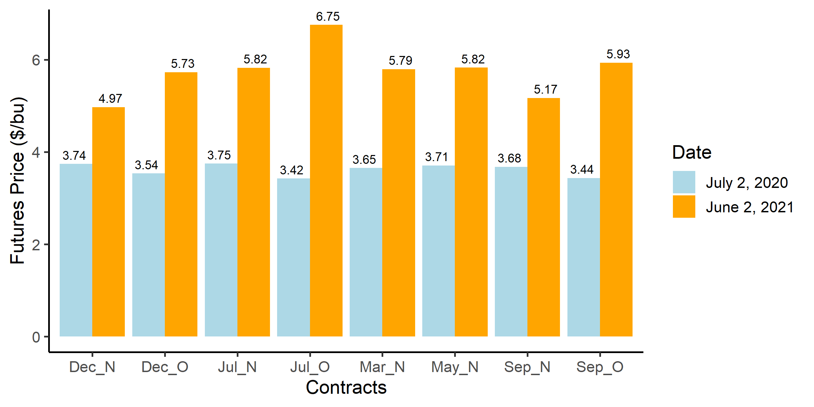
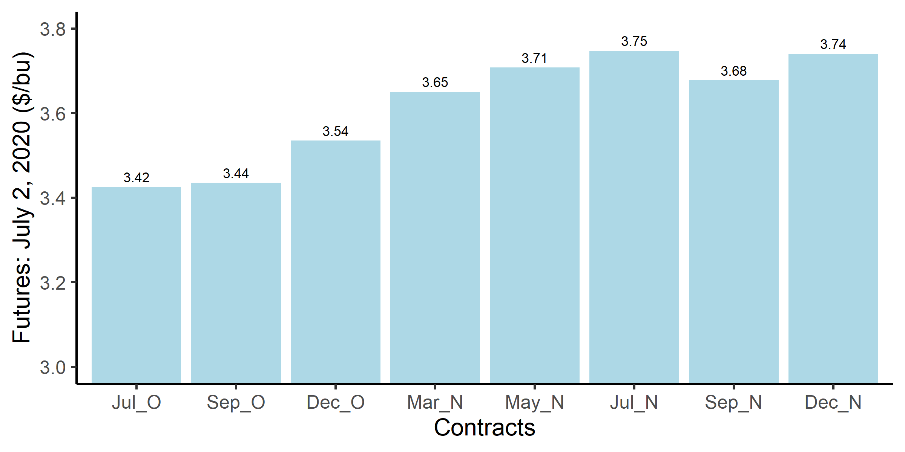
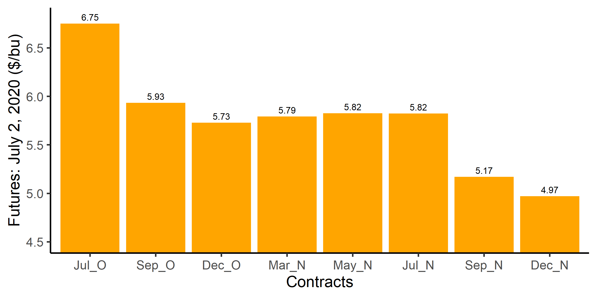

```{r setup, include=FALSE}
knitr::opts_chunk$set(echo = TRUE)
pacman::p_load(here, dplyr, ggplot2, lubridate, kableExtra, readxl, janitor, tidyverse, purrr)
```

# Learning Outcomes

By working on this module you should be able to 

- 
- 


# Overview of this Module

Insert overview here

## Diversification Benefits of Commodities

:::: {.columns}

::: {.column width="50%"}
```{r correlation, echo=FALSE, fig.cap = "One year rolling return correlations", fig.align='center', out.width = "80%"}
knitr::include_graphics("Images/tangxiong2012.png")
```
:::

::: {.column width="50%"}
In Figure \@ref(fig:correlation), [Tang and Xiong (2012)](https://www.princeton.edu/~wxiong/papers/commodity.pdf) show the one-year rolling return correlations of oil with various commodities, together with the 95% confidence levels.

  - Assets which have a negative or low correlation with oil are desirable for diversification.
  - Notice the strong increase in the correlations in the run up to the commodity price boom of the mid 2000s. 
:::
::::

# Case Studies:  Two Commodity ETFs

  - Dow Jones-UBS Commodity Index (DJ-UBSCI) created in 2009 -- now called the Bloomberg Commodity Index. Read more from [Investing.com](https://www.investing.com/commodities/dow-jones-ubs-commodity) or [Wikipedia](https://en.wikipedia.org/wiki/Bloomberg_Commodity_Index)
  - [Powershares DB Agriculture Fund](https://etfdb.com/etf/DBA/#etf-ticker-profile) 
  - Benchmark with [Bank of Canada's commodity price index](https://www.bankofcanada.ca/rates/price-indexes/bcpi/)

The number of futures contracts held for each commodity are adjusted on a regular basis because price changes will affect the weight a commodity has within a portfolio. 

:::: {.columns}

::: {.column width="20%"}
```{r dbag, echo=FALSE, fig.cap = "DB Agriculture Index Commodities", fig.align='center', out.width = "100%"}
knitr::include_graphics("Images/db_ag.png")
```
:::

::: {.column width="80%"}
```{r bloombergindex, echo=FALSE, fig.cap = "Bloomberg Commodity Index Component Weights", fig.align='center', out.width = "80%"}

```
:::

::::

In Figure \@ref(fig:bloombergindex-ts), the Bloomberg Commodity Index (black) performed poorly from 2017 to early 2020. Recent growth is well below the S&P 500 (orange).

```{r bloombergindex-ts, echo=FALSE, fig.cap = "Bloomberg Commodity Index and S&P500", fig.align='center', out.width = "50%"}
knitr::include_graphics("Images/bloombergindex_ts.png")
```

In this [article](https://www.etf.com/publications/journalofindexes/joi-articles/12274-better-beta-in-commodities-indexing.html), the author blames the poor performance of a crude oil ETF on frequent (once per month) contract rolling to avoid delivery. Rolling implies offseting a position in a futures contract set to expire, and taking a position in the next available contract. In Figure \@ref(fig:etf-rollyield) the author explains that rolling in a contango market results in a negative roll yield because for each roll, the investor is selling out of a lower-priced contract and buying into a higher priced contract. 

```{r etf-rollyield, echo=FALSE, fig.cap = "Bloomberg Commodity Index and S&P500", fig.align='center', out.width = "80%"}

```

In this lecture, we focus on roll yield for commodity futures. 

# Backwardation

In [Module 2D](https://vercammen.github.io/module2d.html) we used the eight quarter model to show that a USDA forecast for a sizeable weak Q8 carry out demand caused the forward curve to pivot down.

In Figure \@ref(fig:backwardation), we can see that the further out in time we go, the lower the expected spot price. As an example, let F1 = December contract, F2 = March contract, and F3 = May contract. Figure \@ref(fig:backwardation) shows that in time $t$, the expected spot price of the December contract is higher than the expected spot price of the March contract, and the expected spot price of the March contract is higher than the expected spot price of the May contract.

```{r backwardation, echo=FALSE, fig.cap = "Expected Spot Price Path and Forward Curve with Backwardation", fig.align='center'}
knitr::include_graphics("Images/backwardation.png")
```

# Contango 

Contango refers to an upward sloping forward curve. 

In [Module 2D](https://vercammen.github.io/module2d.html)  we used the eight quarter model to show that a USDA forecast for a sizeable strong Q8 cary out demand caused the forward curve to pivot up.

In Figure \@ref(fig:contango), we can see that the further out in time we go, the higher the expected spot price. As an example, let F1 = December contract, F2 = March contract, and F3 = May contract. Figure \@ref(fig:contango) shows that in time $t$, the expected spot price of the December contract is lower than the expected spot price of the March contract, and the expected spot price of the March contract is lower than the expected price of the May contract. 

```{r contango, echo=FALSE, fig.cap = "Expected Spot Price Path and Forward Curve with Contango", fig.align='center', out.width = "50%"}
knitr::include_graphics("Images/contango.png")
```

<!-- Only if you want to put these two images side by side!  -->
:::: {.columns}

<!-- I put 88% figure size for backwardation just to align the two pictures together!  -->
::: {.column width="50%"}
```{r backwardation2, echo=FALSE, fig.cap = "Expected Spot Price Path and Forward Curve with **Backwardation**", fig.align='center', out.width = "88%"}
knitr::include_graphics("Images/backwardation.png")
```
:::

::: {.column width="50%"}
```{r contango2, echo=FALSE, fig.cap = "Expected Spot Price Path and Forward Curve with **Contango**", fig.align='center', out.width = "100%"}
knitr::include_graphics("Images/contango.png")
```
:::

::::

# COVID Impacts on Corn Forward Curves

The blue bars in Figure \@ref(fig:corn) show the futures prices of different corn contracts on July 2, 2020 (right in the middle of the COVID-19 pandemic), and the orange bars show the futures prices of different corn contracts on June 2, 2021 (market was rebounding from COVID-19 pandemic). 

There was a strong contango market due to COVID-19 in July 2020. And as the markets rebound, we observe a backwardated market with current price higher than futures prices trading at a later date. 

```{r corn, echo=FALSE, fig.cap = "Contango (July 2020) and Backwardation (June 2021) in CME Corn Futures", fig.align='center', out.width = "60%"}

```

:::: {.columns}

::: {.column width="50%"}
```{r corn-20, echo=FALSE, fig.cap = "Contango (July 2020) in CME Corn Futures", fig.align='center', out.width = "80%"}

```
:::

::: {.column width="50%"}
```{r corn-21, echo=FALSE, fig.cap = "Backwardation (June 2021) in CME Corn Futures", fig.align='center', out.width = "80%"}

```
:::

::::

# Roll Yield 

# Case Study: Crude Oil

Spot prices for oil come from the [U.S. E.I.A.](https://www.eia.gov/dnav/pet/hist/rwtcD.htm)

Figure \@ref(fig:wti-contango) shows the WTI Basis and March 2021 futures for a contango scenario. In this case, the basis is negative. This means that the cash price is lower than the first to expire futures price, which is then lower than the next following to expire futures price. The negative values of the basis suggest that we are in a contango market. 

```{r wti-contango, echo=FALSE, fig.cap = "WTI Crude Oil Futures and Basis **with Contango**", fig.align='center', out.width = "60%"}

```

:::: {.columns}

::: {.column width="50%"}
```{r wti-basis-contango, echo=FALSE, fig.cap = "WTI Crude Oil Basis **with Contango**", fig.align='center', out.width = "100%"}

```
:::

:::{.column width="50%"}
```{r wti-futures-contango, echo=FALSE, fig.cap = "WTI Crude Oil Futures **with Contango**", fig.align='center', out.width = "100%"}
knitr::include_graphics("Images/wti_futures_contango.png")
```
:::

::::

In Figure \@ref(fig:forward-contango), we can see that the the forward curve is sloping upward. 

```{r forward-contango, echo=FALSE, fig.cap = "Forward Curve in a Contango Market", fig.align='center', out.width = "50%"}
knitr::include_graphics("Images/forward_contango.png")
```

```{r, eval = F}
```
Figure \@ref(fig:wti-backwardation) shows the WTI Basis and March 2021 futures for a contango scenario. In this case, the basis is falling but it is positive, which means that the cash price is higher than the next to expire futures contract, which has a price higher than the next following to expire futures contract.

```{r wti-backwardation, echo=FALSE, fig.cap = "WTI Crude Oil Futures and Basis **with Backwardation**", fig.align='center', out.width = "60%"}

```

:::: {.columns}

::: {.column width="50%"}
```{r wti-basis-back, echo=FALSE, fig.cap = "WTI Crude Oil Basis **with Backwardation**", fig.align='center', out.width = "100%"}
knitr::include_graphics("Images/wti_basis_back.png")
```
:::

:::{.column width="50%"}
```{r wti-futures-back, echo=FALSE, fig.cap = "WTI Crude Oil Futures **with Backwardation**", fig.align='center', out.width = "100%"}

```
:::

::::

## Backwardation scenario

In Figure\@ref(fig:forward-backwardation), we can see that the the forward curve is sloping downward. 

```{r forward-backwardation, echo=FALSE, fig.cap = "Forward Curve in a Contango Market", fig.align='center', out.width = "50%"}
knitr::include_graphics("Images/forward_backwardation.png")
```

# Constructing a Futures Joined Prices

## Roll Adjustment 

$Cumulative Roll Adjust_i = \sum_{j=1}^{i} RollAdjust_j$ 

We have 5 pricing periods:

  1. before first roll
  2. between first and second roll 
  3. between second and third roll
  4. between third and fourth roll
  5. after the fifth roll
  
## Joining the Futures Price

  1. Pricing Period 1 
    - Joined Price = Back Futures Price
  2. Pricing Period 2
    - Joined Price = Front Futures Price + Cumulative Roll $Adjustment_1$
  3. Pricing Period 3 
    - Joined Price = Front Futures Price + Cumulative Roll $Adjustment_2$
  4. Pricing Period 4 
    - Joined Price = Front Futures Price + Cumulative Roll $Adjustment_3$
  5. Pricing Period 5 
    - Joined Price = Front Futures Price + Cumulative Roll $Adjustment_4$

```{r}
combined_21 <- readRDS(here("Data", "combined_21.RDS"))

options(knitr.kable.NA ='')

combined_21 %>% select(time, spot, aug_21:dec_21, cum_roll, joined) %>%
  filter((time >= "2021-07-15" & time <= "2021-07-21") | (time >= "2021-08-19" & time <= "2021-08-23") | (time >= "2021-09-20" & time <= "2021-09-22") | (time >= "2021-10-19" & time <= "2021-10-21") | time == "2021-11-19") %>% 
  kbl() %>% kable_styling(full_width = F)
```

## Verification that joined futures prices correctly calculates cumulative profits

:::: {.columns}

::: {.column width="50%"}
```{r, echo = F}
investor_a <- readRDS(here("Data", "investor_a.RDS"))

investor_a %>% kbl(caption = "Investor A") %>% kable_styling(full_width = F) %>% row_spec(3, bold = T)
```
:::

::: {.column width="50%"}
```{r, echo = F}
investor_b <- readRDS(here("Data", "investor_b.RDS"))

investor_b %>% kbl(caption = "Investor B") %>% kable_styling(full_width = F) %>% row_spec(6, bold = T)
```
:::
::::

